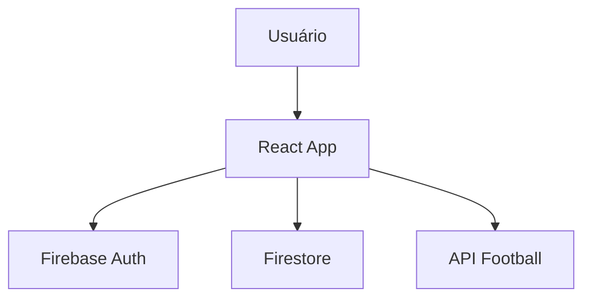

<!-- BANNER -->
<p align="center">
  
</p>

<h1 align="center">🏆 Bolão Copa do Mundo 2026</h1>

<p align="center">
  <b>Chute o placar, suba no ranking e prove que você entende de futebol ⚽</b>
</p>

<p align="center">
  <a href="#-demo">Demo</a> •
  <a href="#-preview">Preview</a> •
  <a href="#-funcionalidades">Funcionalidades</a> •
  <a href="#-tecnologias">Tecnologias</a> •
  <a href="#-instalação">Instalação</a> •
  <a href="#-roadmap">Roadmap</a> •
  <a href="#-contribuição">Contribuição</a>
</p>

---

## 🚀 Demo

🔗 Em breve (ou adicione seu link aqui)  
Ex: https://bolao-2026.web.app

---

## 📸 Preview

### 🏠 Tela inicial
<p align="center">
  
</p>

### 📊 Ranking
<p align="center">
  
</p>

### 🧾 Palpites
<p align="center">
  
</p>

---

## 🎬 Demonstração (GIF)

<p align="center">
  
</p>

---

## ✨ Funcionalidades

### ⚽ Sistema completo de bolão

- 🎯 Palpites para todos os jogos
- 🏆 Classificação de grupos
- 🔥 Mata-mata automático
- 🥇 Campeão + bônus
- 📊 Ranking em tempo real

---

### 🔐 Autenticação

- Login com Google
- Email e senha
- Firebase Auth

---

### 🛠 Administração

- Gerenciar jogos
- Editar resultados
- Recalcular ranking
- Importar dados JSON
- Sincronizar API

---

### 📱 UX moderna

- 100% responsivo
- Interface limpa
- Performance otimizada

---

## 🧠 Arquitetura



---

## 🧰 Tecnologias

<p align="center">


</p>

- React 18
- Vite
- Firebase (Auth + Firestore + Hosting)
- API-Football
- GitHub Actions

---

## ⚙️ Instalação

```bash
# Clone o projeto
git clone https://github.com/LucasRiboldi/bolao-2026.git

# Entre na pasta
cd bolao-2026/client

# Instale dependências
npm install
```

---

## 🔑 Variáveis de ambiente

Crie um `.env`:

```env
VITE_FIREBASE_API_KEY=
VITE_FIREBASE_AUTH_DOMAIN=
VITE_FIREBASE_PROJECT_ID=
VITE_FIREBASE_STORAGE_BUCKET=
VITE_FIREBASE_MESSAGING_SENDER_ID=
VITE_FIREBASE_APP_ID=
VITE_API_FOOTBALL_KEY=
```

---

## ▶️ Rodando localmente

```bash
npm run dev
```

---

## 🚀 Deploy

```bash
npm run build
firebase deploy
```

---

## 📦 Estrutura

```bash
client/
 ├── src/
 │   ├── components/
 │   ├── utils/
 │   ├── App.jsx
 │   └── main.jsx
 ├── public/
 └── package.json
```

---

## 🔒 Segurança

- 🔐 Firebase Auth
- 📜 Firestore Rules
- 🔑 Variáveis protegidas (.env)
- 🌐 HTTPS

---

## 🧪 Qualidade

- ESLint
- Código modular
- Hooks modernos
- Arquitetura escalável

---

## 📋 Roadmap

- [ ] 🌙 Dark Mode
- [ ] 📲 PWA
- [ ] 🔔 Notificações
- [ ] 📈 Gráficos
- [ ] 📊 Dashboard admin
- [ ] 📤 Exportar CSV
- [ ] 🖼 Compartilhar ranking

---

## 🤝 Contribuição

```bash
git checkout -b feature/minha-feature
git commit -m "feat: nova feature"
git push origin feature/minha-feature
```

Abra um Pull Request 🚀

---

## 📄 Licença

MIT License

---

## 🙌 Autor

<p align="center">
  <b>Lucas Riboldi</b><br>
  Feito com ⚽ + ☕
</p>

---

## ⭐ Apoie o projeto

Se curtiu, deixa uma ⭐ no repositório!

---
